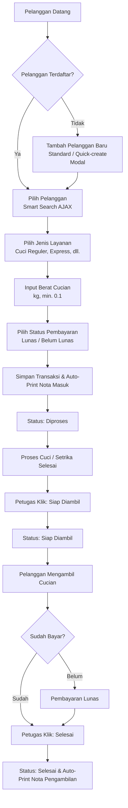
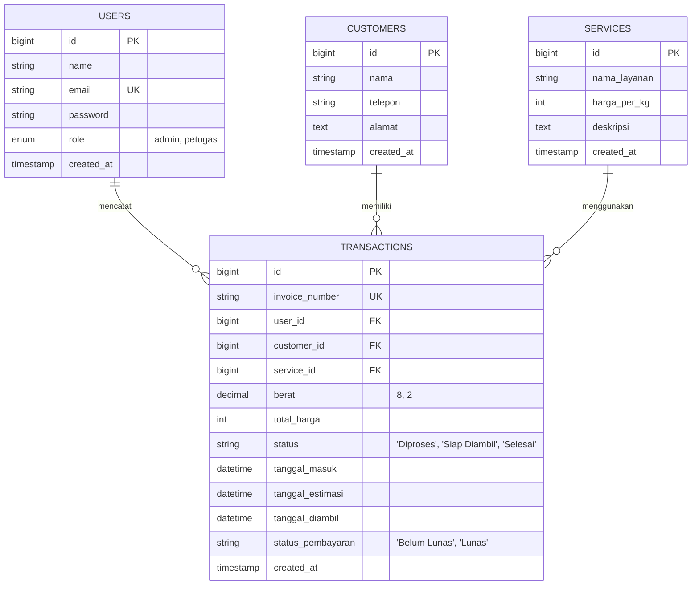

# Dokumen Persyaratan Produk (Product Requirement Document - PRD) & Analisis Sistem: LaundryKu

Dokumen ini berisi analisis mendalam tentang sistem manajemen laundry **LaundryKu** beserta spesifikasi kebutuhan produk yang mencerminkan fungsionalitas sistem saat ini dan rekomendasi pengembangan ke depan.

---

## 1. Pendahuluan & Latar Belakang

- **Nama Produk:** LaundryKu
- **Deskripsi:** Aplikasi manajemen laundry berbasis web yang dirancang khusus untuk mempermudah operasional outlet laundry kiloan. Aplikasi ini mengintegrasikan pencatatan transaksi, pengelolaan pelanggan, daftar layanan, pembuatan laporan pendapatan, dan pencetakan nota secara real-time.
- **Tujuan Sistem:**
  - Digitalisasi pencatatan transaksi masuk dan keluar laundry secara efisien.
  - Meminimalkan kesalahan manusia dalam perhitungan total harga transaksi.
  - Membantu pemilik (Owner/Admin) memantau performa keuangan melalui laporan pendapatan harian dan bulanan yang otomatis.
  - Mempercepat proses pendaftaran transaksi dengan fitur smart customer search (AJAX) dan input kilat.

---

## 2. Analisis Arsitektur & Teknologi (Tech Stack)

Aplikasi ini dibangun menggunakan arsitektur modern berkinerja tinggi yang responsif:
- **Framework Utama:** Laravel 11.x (PHP 8.2+) dengan struktur folder standar yang modular, aman, dan mudah dikembangkan.
- **Database:** MySQL / MariaDB sebagai database relasional utama.
- **Frontend / Styling:** Tailwind CSS 3.x untuk layouting yang responsif dan estetis, serta Alpine.js untuk interaktivitas dinamis (AJAX autocomplete pada form transaksi, handling modal, toggle dark/light mode, toast message, dan loading overlay).
- **PDF Engine:** `Barryvdh/Laravel-DomPDF` untuk melakukan render HTML ke dokumen PDF (digunakan pada cetak Nota Masuk dan Nota Pengambilan ukuran thermal roll paper).
- **Authentication:** Autentikasi berbasis session menggunakan modul otentikasi standar Laravel dengan pemisahan Role-Based Access Control (RBAC) pada middleware.

---

## 3. Manajemen Akses Pengguna (Role-Based Access Control - RBAC)

Aplikasi membedakan hak akses berdasarkan peran pengguna (Role) untuk menjaga keamanan data bisnis:
- **Admin (Owner):** Memiliki hak penuh untuk mengelola master data layanan, mengelola akun user (petugas/admin lain), melihat laporan pendapatan, memproses transaksi (tambah/ubah status/hapus), serta mengelola pelanggan.
- **Petugas (Staff):** Memiliki hak operasional harian seperti mencatat transaksi baru, mengubah status cucian, mencetak nota, serta mengelola data pelanggan (lihat/tambah/edit). Petugas **tidak diizinkan** menghapus transaksi, menghapus pelanggan, mengelola data layanan (harga/nama layanan), mengelola user lain, atau mengakses laporan pendapatan bulanan/tahunan.

### Tabel Hak Akses Detail:
| Fitur / Modul | Admin | Petugas | Keterangan / Guard Pengamanan |
| :--- | :---: | :---: | :--- |
| **Login / Logout & Profile** | Ya | Ya | Standar autentikasi |
| **Melihat Dashboard** | Ya | Ya | Dengan metrik statistik & grafik |
| **Pencarian Global** | Ya | Ya | Mencari transaksi, pelanggan, layanan dari navbar |
| **Daftar Pelanggan** | Ya | Ya | Melihat riwayat & info kontak |
| **Tambah/Edit Pelanggan** | Ya | Ya | Termasuk smart quick-create via modal |
| **Hapus Pelanggan** | Ya | Tidak | Dibatasi oleh middleware `'admin'` |
| **Daftar Layanan** | Ya | Ya | Hanya melihat detail & harga per kg |
| **Tambah/Edit/Hapus Layanan** | Ya | Tidak | Master harga dikontrol admin via middleware `'admin'` |
| **Tambah/Edit Transaksi** | Ya | Ya | Operasional kasir harian |
| **Hapus Transaksi** | Ya | Tidak | Mencegah fraud oleh kasir/petugas |
| **Cetak Nota (Masuk & Ambil)** | Ya | Ya | Format thermal roll 80mm |
| **Update Status Transaksi** | Ya | Ya | 'Diproses' -> 'Siap Diambil' -> 'Selesai' |
| **Manajemen User** | Ya | Tidak | CRUD Akun Petugas/Admin via middleware `'admin'` |
| **Laporan Pendapatan** | Ya | Tidak | Laporan harian/bulanan via middleware `'admin'` |

---

## 4. Alur Bisnis & Siklus Transaksi (Business Workflow)

Berikut adalah siklus hidup (lifecycle) cucian dari mulai diserahkan oleh pelanggan hingga diambil kembali:

---

## 5. Model Data & Skema Database

Sistem terdiri dari 4 tabel utama yang saling berelasi dengan integritas data referensial:
1. **Tabel `users`**: Menyimpan data administrator dan petugas laundry untuk autentikasi.
2. **Tabel `customers`**: Menyimpan informasi kontak pelanggan.
3. **Tabel `services`**: Menyimpan katalog layanan laundry beserta tarif per kg.
4. **Tabel `transactions`**: Tabel transaksional utama yang mencatat detail berat, total harga, status pengerjaan, status pembayaran, serta relasi ke user, customer, dan service.

### Entity Relationship Diagram (ERD):

---

## 6. Persyaratan Fungsional (Functional Requirements)

Modul-modul fungsional yang harus dipenuhi oleh sistem saat ini:

### 6.1. Sistem Autentikasi & Otorisasi
- Pengguna harus masuk ke sistem menggunakan email dan password terdaftar.
- Hak akses dibatasi secara ketat berdasarkan role (`admin` vs `petugas`) menggunakan alias middleware (`admin` dan `petugas`) pada route web.
- Perlindungan tambahan di tingkat controller (`abort_if`) untuk memastikan keamanan meskipun route diakses secara ilegal.

### 6.2. Dashboard Interaktif & Analitik
- **Metrik Utama:** Menampilkan total pelanggan, total transaksi, cucian diproses, cucian siap diambil, pendapatan hari ini, pendapatan bulan ini, pendaftaran pelanggan baru hari ini, jumlah transaksi hari ini, dan jumlah cucian aktif.
- **Grafik Tren Pendapatan:** Grafik garis bulanan sepanjang tahun berjalan (menggunakan Chart.js) untuk melacak perkembangan keuangan outlet.
- **Chart Status Cucian:** Grafik lingkaran untuk menunjukkan proporsi status cucian saat ini (`Diproses`, `Siap Diambil`, `Selesai`).
- **Daftar Aktivitas:** List cepat 8 Transaksi Terbaru dan 5 Transaksi Aktif (Diproses / Siap Diambil) untuk mempermudah pemantauan langsung dari halaman utama.

### 6.3. Manajemen Pelanggan (Customer Management)
- Pencarian pelanggan secara real-time pada tabel index berdasarkan nama, nomor telepon, atau alamat.
- Standard CRUD untuk data pelanggan: Nama, Nomor Telepon, Alamat.
- Penghapusan pelanggan hanya diizinkan bagi pengguna dengan peran Admin.

### 6.4. Manajemen Layanan (Service Management)
- CRUD master data layanan laundry kiloan (Nama Layanan, Harga Per Kg, Deskripsi).
- Pengamanan Relasi: Layanan tidak dapat dihapus jika masih ada transaksi (aktif maupun selesai) yang merujuk pada layanan tersebut guna menjaga keutuhan data riwayat keuangan.

### 6.5. Pendaftaran & Pengolahan Transaksi
- **Smart Customer Selection:** Input pencarian AJAX dinamis pada form transaksi. Petugas dapat mengetik nama/nomor telepon pelanggan (minimal 2 karakter) untuk menampilkan hasil pencocokan instan.
- **Quick-Create Customer Modal:** Apabila pelanggan baru belum terdaftar, petugas dapat menekan tombol tambah pelanggan baru yang akan membuka modal form pembuatan pelanggan via AJAX, kemudian otomatis memilih pelanggan yang baru dibuat tersebut tanpa memuat ulang (reload) halaman.
- **Kalkulator Harga Real-Time:** Total harga dihitung secara otomatis di sisi klien (`Total = Berat * Harga per Kg` dari layanan terpilih) saat kasir mengganti jenis layanan atau mengubah input berat cucian.
- **Invoice Auto-Generation:** Pembuatan nomor invoice otomatis dengan pola unik harian: `INV-YYYYMMDDXXXX` (contoh: `INV-202607090001` untuk transaksi pertama pada tanggal 9 Juli 2026).
- **Proses Perubahan Status:**
  - **Diproses:** Status awal cucian masuk.
  - **Siap Diambil:** Tombol pintas cepat di dashboard atau detail transaksi untuk mengubah status cucian ketika pengerjaan selesai.
  - **Selesai:** Cucian diserahkan kepada pelanggan, sistem otomatis mencatat `tanggal_diambil` dengan waktu saat ini, dan membuka halaman cetak nota pengambilan.
- **Cetak Nota PDF:**
  - Sistem membuat layout cetak nota khusus berukuran kertas kasir thermal roll (80mm).
  - **Nota Masuk / Penerimaan:** Bukti fisik bagi pelanggan berisi nomor invoice, nama pelanggan, layanan, berat, total harga, status pembayaran, tanggal masuk, dan tanggal estimasi selesai.
  - **Nota Pengambilan:** Dibuat setelah cucian diserahkan (status Selesai), berfungsi sebagai bukti serah terima cucian dan pelunasan pembayaran.

### 6.6. Laporan Keuangan & Pendapatan
- Laporan dinamis yang membedakan pencatatan **Harian** (filter per tanggal tertentu) dan **Bulanan** (filter berdasarkan bulan & tahun).
- Rekapitulasi otomatis mengenai total volume transaksi dan total pendapatan bersih pada periode terpilih.
- Laporan hanya dapat diakses oleh Admin.

### 6.7. Pencarian Global
- Bar pencarian universal di bagian navbar atas yang memungkinkan kasir mengetik nomor invoice, nama pelanggan, atau nama layanan secara cepat untuk langsung melompat ke data yang dimaksud.

---

## 7. Persyaratan Non-Fungsional (Non-Functional Requirements)

- **Keamanan Data:** Proteksi terhadap serangan CSRF di setiap form. Enkripsi satu arah untuk password pengguna menggunakan algoritma `bcrypt`.
- **Akurasi Perhitungan:** Input desimal pada berat cucian minimal bernilai 0.1 Kg untuk memastikan cucian ringan tetap terhitung secara adil.
- **Responsivitas & Tampilan Premium:** Desain UI premium menggunakan tema modern, lengkap dengan efek glassmorphism, micro-animations, loading overlay yang smooth, sistem toast alert dinamis, serta dukungan penuh untuk mode gelap (Dark Mode) otomatis sesuai preferensi sistem operasi.
- **Logging Kegagalan:** Perekaman error database secara detail di logger Laravel (`storage/logs/laravel.log`) untuk melacak kegagalan transaksi, pendaftaran, atau hapus data secara aman tanpa membocorkan detail teknis sistem kepada pengguna.

---

## 8. Rekomendasi Pengembangan Masa Depan (Roadmap & Improvements)

Untuk meningkatkan efisiensi operasional dan kepuasan pelanggan, berikut beberapa modul yang dapat ditambahkan pada versi berikutnya:

1. **Integrasi WhatsApp Gateway:** Pengiriman notifikasi otomatis via WhatsApp ke nomor telepon pelanggan saat cucian baru didaftarkan (nota digital) dan saat cucian selesai diproses serta siap diambil.
2. **Pembayaran Cashless (E-Wallet/QRIS):** Integrasi payment gateway lokal (seperti Midtrans, Xendit, atau Doku) agar pelanggan dapat membayar tagihan secara online melalui QRIS atau transfer bank dari tautan nota digital mereka.
3. **Multi-Outlet (Multi-Cabang):** Dukungan pengelolaan lebih dari satu outlet laundry dari satu dashboard pusat milik owner, lengkap dengan penugasan petugas pada outlet tertentu.
4. **Laundry Satuan (Itemized Laundry):** Penambahan katalog untuk laundry satuan (seperti jas, gaun, sepatu, karpet, boneka, atau selimut) yang memiliki harga satuan per barang, di samping layanan kiloan yang sudah ada.
5. **Program Loyalitas Pelanggan:** Fitur pengumpulan poin berdasarkan berat cucian atau nilai transaksi yang dapat ditukarkan dengan diskon cucian gratis.
